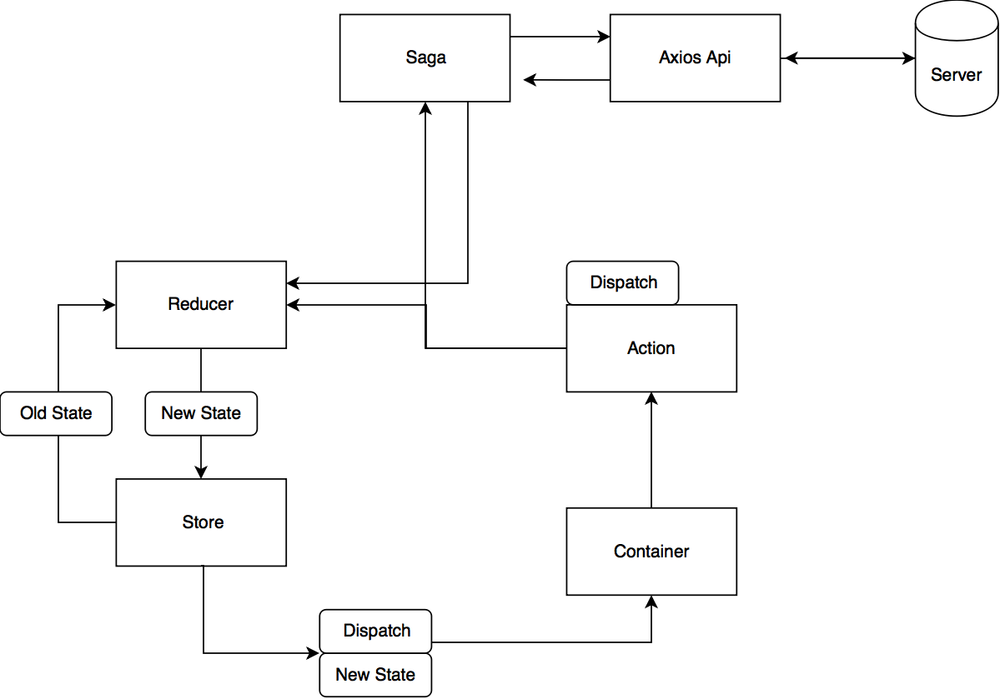
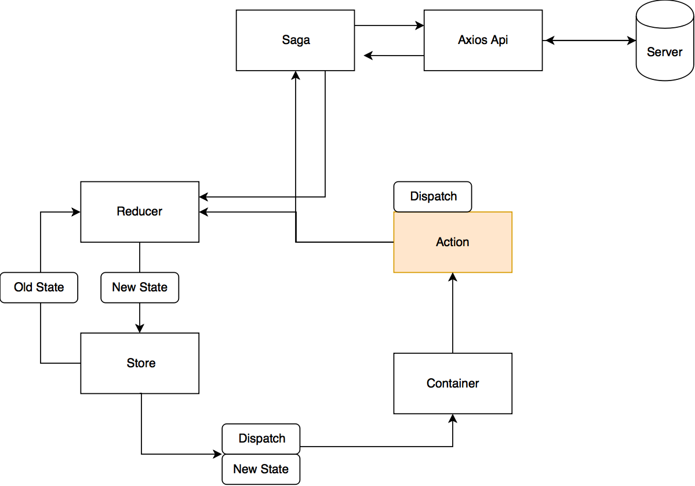
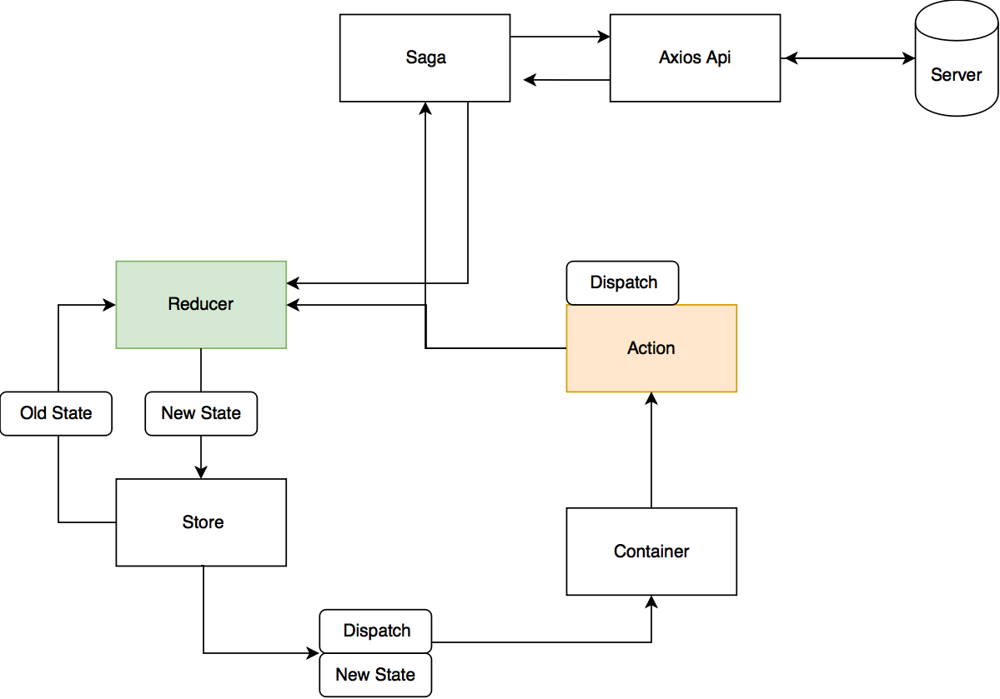
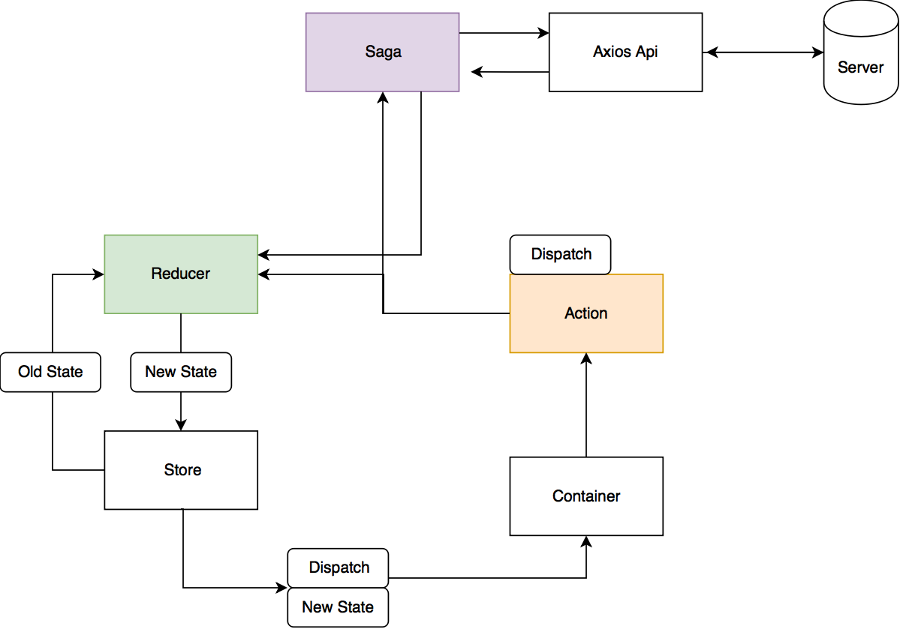
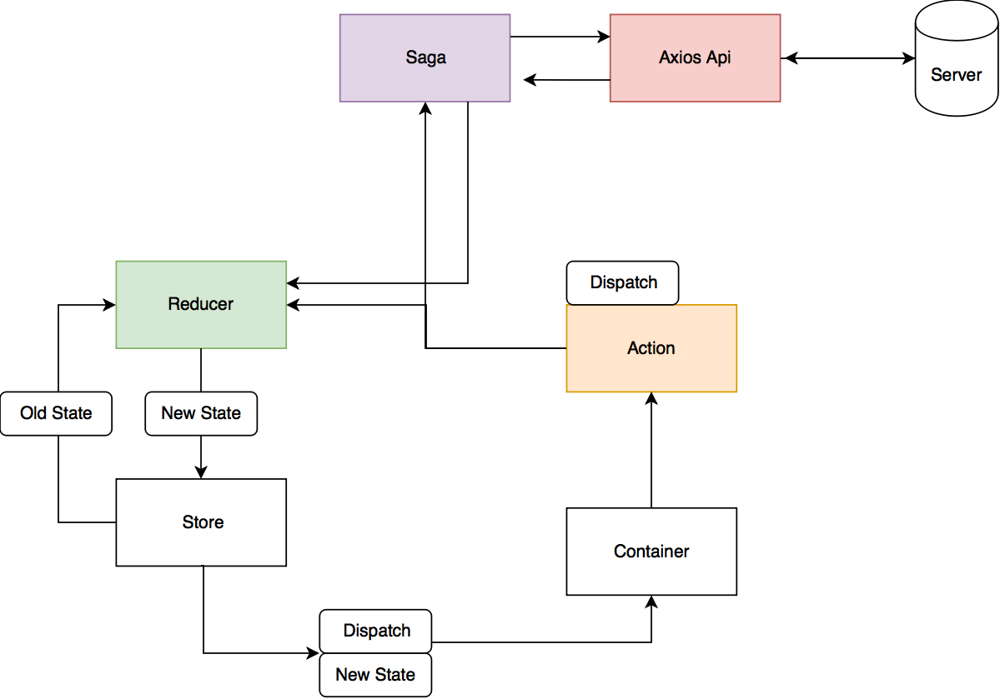
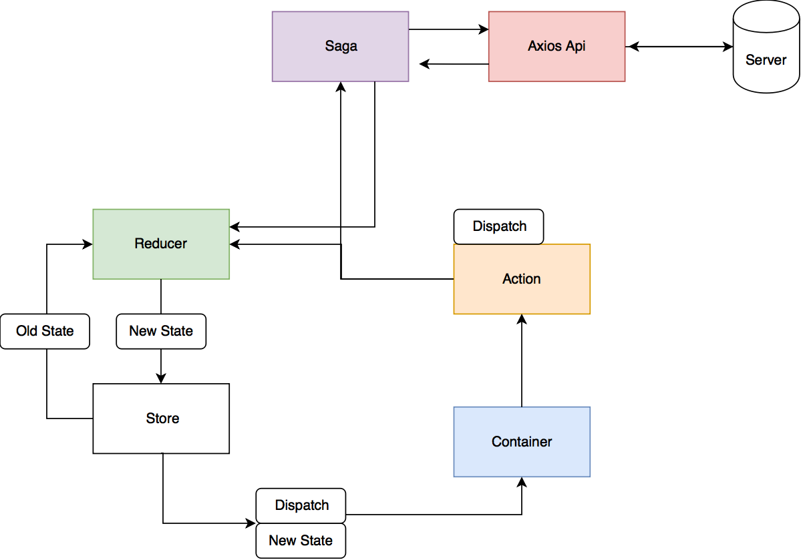
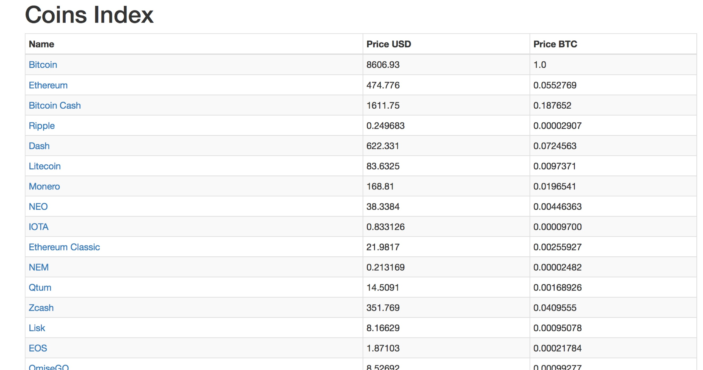
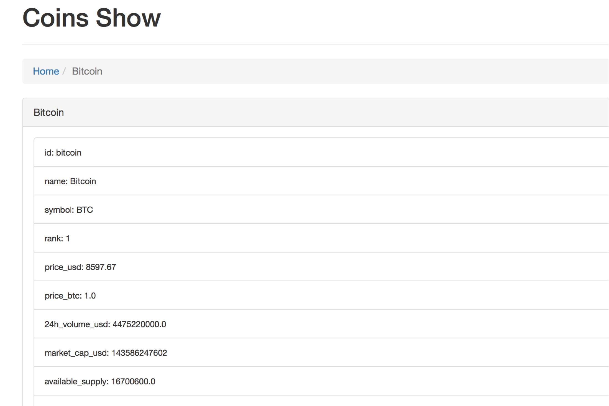

# アバウト
このリポジトリはs2s Redux Actionsのサンプルプロジェクトです。
React Reduxアプリケーションをs2s補完を使って開発する方法を紹介します。

# 始める

下のコマンドでライブラリをインストールします。

```
$ yarn
```

# サーバの起動
このアプリケーションは２つのサーバがあります。Reactサーバとs2sサーバです。 \
最初にメインのReact サーバを立ち上げましょう。

```
$ yarn start
```

別のターミナルウィンドウでs2sサーバを起動します。

```
$ yarn run s2s
```

Reactサーバが起動するとブラウザが開きます。 \
公開された暗号通貨のAPIサーバから取ってきた情報が表示されます。

# 使い方

チュートリアルを飛ばして、具体的なRedux Actions pluginの使い方を知りたい方は \
以下のリンクから Redux Actions Manager pluginを使った開発の仕方を見てください。

- [Redux Actions Manager pluginを使った開発](#redux-actions-manager-pluginを使った開発)

# チュートリアル

## チュートリアル概要
このチュートリアルはs2s-redux-actionsを使ってwebサービスを作る事を目的としています。 \
このWebサービスは、暗号化情報を公開しているapiサーバからデータを取得して表示します。
既に仮想通貨の一覧表示は完成しています。以下のコマンドで確認できるでしょう。

```
yarn start
```

このチュートリアルでは仮想通貨の詳細ページを作成する一連の流れを紹介しています。 \
ぜひ楽しんで読んでもらえればと思っております。

## react redux actionsのこれまで

今まで、React Reduxのアプリケーションはファイル作成と設定記述があまりに多すぎました。 \
私はなんとかこの辺りの面倒な記述を簡略化できないかとgithubを漁ったり、Midiumを見て回ったのですが、これと言って大きく改善できそうなものはありませんでした。

その結果、React Reduxはアプリケーションを書き始めるまでの準備が多くなり、肝心のContainerとComponent作成やデザインになかなか取り組めませんでした。

もちろん時間をかけてコツコツやることは可能です。

しかし、Railsをやっている人からすると、Railsの理念である「設定より規約 CoC（Convention over Configuration）」や「同じことを繰り返さない DRY（Don't Repeat Yourself）」から大きくかけ離れるReact Reduxコーディングは苦痛を伴いました。

そんな中、s2sが登場し、ボイラープレートやコピーアンドペーストに頼らないコーディングの可能性が見えてきました。

本家のs2sはRedux-Actionsをサポートしたプラグインが無かったので、ものは試しと作って見ました。

これはs2sの使い方を紹介すると共に、React Reduxフレームワークがどのように機能しているかを解説します。

### React Reduxの構造

この記事に書いてあることを参考に以下のようにこのアプリケーションは組まれています。
https://qiita.com/mpyw/items/a816c6380219b1d5a3bf




実際に今すでにあるCoinsIndexで使われている構造で表すとこの様になります。


それでは仮想通貨の詳細情報を表示するCoinsShow containerを作りましょう。

### 準備
トップディレクトリに置かれている`s2s.config.js`はmanager pluginを使った設定になっているので、チュートリアル用に変更します。 \
チュートリアル用のs2s設定ファイルは`s2s.tutorial.config.js`です。

```
$ mv s2s.config.js s2s.main.config.js
$ mv s2s.tutorial.config.js s2s.config.js
```

### Redux Actionsの作成

はじめに、redux actionを作成します。src/actionsフォルダにcoin.jsファイルを作成します。 \
すると、s2sのテンプレート機能が発火して、coin.jsにredux actionsのテンプレートコードが挿入されます。

```js
import { createAction } from 'redux-actions'
```

このテンプレートはトップディレクトリのtemplatesにあるredux-action.jsになります。

ファイルを開いて、`getCoinRequest`と書き込み、保存しましょう。 \
s2sがこの様にコードを展開してくれます。

```js
import { createAction } from "redux-actions";

export const getCoinRequest = createAction("GET_COIN_REQUEST");
export const getCoinSuccess = createAction("GET_COIN_SUCCESS");
export const getCoinFailure = createAction("GET_COIN_FAILURE");
```

この処理を行なっているs2s pluginはs2s-redux-actionsになります。

`src/actions`以下でファイルの変更が行われると同時にs2s-redux-actions-rootが起動して、 `src/actions/index.js`に`coin.js`のパスが挿入されます。

つまり、s2sがactionsフォルダのファイルを監視しているので、あなたは`src/actions/index.js`にファイルを作成するたびにコードを書き足さなくても良くなります。

`src/actions/index.js`
```js
export * from "./coin";
export * from "./coins";
```

これで、redux actionsが作成できました。概念図で表すとオレンジ色の「Action」が完成したことになります。



### Redux Actions Reducersの作成

続いて、StateをActionに基づいて生成するReducerを作りましょう。
Reducerは先ほど作成したActionと１対１で結びついており、ActionがContainerで呼ばれると、Reducerに記述されたStateの作成が行われ、Containerに渡します。

概念図を持てもわかる様に、Stateを更新するというというよりかは、新しいStateを作成する方法を採用します。

`src/reducers`フォルダに`coin.js`を作成します。
Actionの時と同じ様に、テンプレートが展開されます。

```js
import { handleActions } from 'redux-actions'
import * as actions from '../actions'

const initialState = {}

export default handleActions(
  {},
  initialState
)
```
少し分かりづらいですが、 handleActionsの`{}`の中に `getCoinRequest`と書いて保存しましょう。

```js  
export default handleActions(
  {getCoinRequest},
  initialState
)
```

S2sが下の様にコードを展開します。

```js
import { handleActions } from "redux-actions";
import * as actions from "../actions";

const initialState = {};

export default handleActions(
  {
    [actions.getCoinRequest]: (state, action) => ({
      ...state
    }),
    [actions.getCoinSuccess]: (state, action) => ({
      ...state
    }),
    [actions.getCoinFailure]: (state, action) => ({
      ...state
    })
  },
  initialState
);
```

多少コードを変更します。
最初に`initialState`に`coin`のデフォルトステートを記述します。 \
続いて、`action.getCoinSuccess`に`coin: action.payload[0]`を追加します。 \
これはsagaで返ってきたデータをcoinステートに流し込む処理です。 \
配列の０番目を指定しているのは、この仮想通貨APIが仮想通貨１つの情報を取得しているにも関わらず、配列でデータを返しているからです。

```js
import { handleActions } from "redux-actions";
import * as actions from "../actions";

const initialState = {
  coin: {
    id: "",
    name: "",
    symbol: "",
    rank: "",
    price_usd: "",
    price_btc: "",
    "24h_volume_usd": "",
    market_cap_usd: "",
    available_supply: "",
    total_supply: "",
    max_supply: "",
    percent_change_1h: "",
    percent_change_24h: "",
    percent_change_7d: "",
    last_updated: ""
  }
};

export default handleActions(
  {
    [actions.getCoinRequest]: (state, action) => ({
      ...state
    }),
    [actions.getCoinSuccess]: (state, action) => ({
      ...state,
      coin: action.payload[0]
    }),
    [actions.getCoinFailure]: (state, action) => ({
      ...state
    })
  },
  initialState
);
```

概念図で表すと、緑色のReducerを作りました。



## Redux Sagasの作成

今度はSagaを作成します。 \
Sagaの役割は非同期でredux-actionsの処理をしてくれるものです。 \
Reducerは原則的に場合によって値が変わる様なプログラムを書いてはいけません。 \
SagaがActionとReducerの間に入り、この問題を解決します。 \

Sagaに記述することは基本的には３つあります。

1. どのアクションが呼ばれた時にsagaを発火するか
2. どのAPIエンドポイントに向かってHTTPリクエストを投げるか
3. リクエストが成功した時と失敗した時でどの様にReducerのステートを変更するかです。

`src/sagas`フォルダに`coin.js`を作成しましょう。 \
S2sがsagaのテンプレートを展開します。

```js
import { put, call,takeLatest } from 'redux-saga/effects';
import * as actions from '../actions';
import api from '../api';

export default [];
```

`export default [];`の前に getCoinRequestと記述して保存しましょう。

```js
import { put, call,takeLatest } from 'redux-saga/effects';
import * as actions from '../actions';
import api from '../api';

getCoinRequest

export default [];
```

S2sが自動的にコードを展開します。

```js
import { put, call, takeLatest } from "redux-saga/effects";
import * as actions from "../actions";
import api from "../api";

export function* handleGetCoinRequest(action) {
  try {
    const { data } = yield call(api.getCoinRequest, action.payload);
    yield put(actions.getCoinSuccess(data));
  } catch (error) {
    yield put(actions.getCoinFailure(error));
  }
}

export default [
  takeLatest(actions.getCoinRequest.toString(), handleGetCoinRequest)
];
```

概念図で見ると紫色のところを作成しました。



## Axios apiを作成

axios apiは主にAPIのエンドポイントを管理する場所です。 \
どのサーバのどのURLにHTTPリクエストを投げるのかを書いていきます。 \
このチュートリアルのaxiosは共通設定コードをsrcフォルダに配置しそれを呼び出して使っています。

`src/api`フォルダに`coin.js`ファイルを作成します。
s2sがaxios apiファイルのテンプレートを挿入します。

```js
import axios from "../axiosConfig"
```

そこに`getCoinRequest`と書いて保存します。 \
s2sが以下のコードを展開します。

```js
import axios from "../axiosConfig";

export const getCoinRequest = config => axios.get(``, config);
```

編集して、仮想通貨の正しいエンドポイントが叩けるようにします。

```js
import axios from "../axiosConfig";

export const getCoinRequest = (id, config) =>
  axios.get(`/v1/ticker/${id}/`, config);

```
概念図で見ると赤いところを作成しました。



これで、Redux Actions S2Sフレームワークのほぼすべてを試しました。
残りはコツコツContainerを書く作業です。

## CoinsShow Containerの作成

それでは作成したRedux Actionを使って、仮想通貨の詳細情報を表示するContainerを作成します。
`src/containers`フォルダに`CoinsShow.js`ファイルを作成します。

s2sのテンプレート機能を使っているので、以下のテンプレートがCoinsShow.jsに挿入されます。

```js
import React, { Component } from 'react'
import PropTypes from 'prop-types'
import { connect } from 'react-redux';
import { bindActionCreators } from 'redux';
import * as actions from '../actions'

class ClassNameHere extends Component{
  render () {
    return ()
  }
}

ClassNameHere.propTypes = {}

const mapStateToProps = (state, ownProps) => {
  return {}
}
const mapDispatchToProps = dispatch => bindActionCreators(
  {},
  dispatch
)

export default connect(mapStateToProps, mapDispatchToProps)(ClassNameHere)
```

ClassNameHereを CoinsShowに変更してください。 \
最終的に以下のコードに書き換えてください。

```js
import React, { Component } from 'react'
import PropTypes from 'prop-types'
import { connect } from 'react-redux';
import { bindActionCreators } from 'redux';
import * as actions from '../actions'
import styled from 'styled-components'
import { Link} from 'react-router'
import {Breadcrumb,ListGroup,ListGroupItem,PageHeader,Panel} from 'react-bootstrap';

class CoinsShow extends Component{
  componentDidMount(){
   this.props.getCoinRequest(this.props.params.id)
  }
  render () {
    const { coin } = this.props
    return (
      <Wrapper>
        <PageHeader>Coins Show</PageHeader>
        <Breadcrumb>
          <Breadcrumb.Item>
            <Link to='/'>Home</Link>
          </Breadcrumb.Item>
          <Breadcrumb.Item active>
            {coin.name}
          </Breadcrumb.Item>
        </Breadcrumb>
        <Panel header={coin.name}>
          <ListGroup>
            <ListGroupItem><small>id: {coin.id}</small></ListGroupItem>
            <ListGroupItem><small>name: {coin.name} </small></ListGroupItem>
            <ListGroupItem><small>symbol: {coin.symbol} </small></ListGroupItem>
            <ListGroupItem><small>rank: {coin.rank} </small></ListGroupItem>
            <ListGroupItem><small>price_usd: {coin.price_usd} </small></ListGroupItem>
            <ListGroupItem><small>price_btc: {coin.price_btc} </small></ListGroupItem>
            <ListGroupItem><small>24h_volume_usd: {coin["24h_volume_usd"]} </small></ListGroupItem>
            <ListGroupItem><small>market_cap_usd: {coin.market_cap_usd} </small></ListGroupItem>
            <ListGroupItem><small>available_supply: {coin.available_supply} </small></ListGroupItem>
            <ListGroupItem><small>total_supply: {coin.total_supply} </small></ListGroupItem>
            <ListGroupItem><small>max_supply: {coin.max_supply} </small></ListGroupItem>
            <ListGroupItem><small>percent_change_1h: {coin.percent_change_1h} </small></ListGroupItem>
            <ListGroupItem><small>percent_change_24h: {coin.percent_change_24h} </small></ListGroupItem>
            <ListGroupItem><small>percent_change_7d: {coin.percent_change_7d} </small></ListGroupItem>
            <ListGroupItem><small>last_updated: {coin.last_updated}</small></ListGroupItem>
          </ListGroup>
        </Panel>
      </Wrapper>
    )
  }
}

CoinsShow.propTypes = {}

const Wrapper = styled.div`
  margin: 25px 40px;
`

const mapStateToProps = (state, ownProps) => {
  return {
    coin: state.coin.coin
  }
}
const mapDispatchToProps = dispatch => bindActionCreators(
  {
    getCoinRequest: bindActionCreators( actions.getCoinRequest, dispatch)
  },
  dispatch
)

export default connect(mapStateToProps, mapDispatchToProps)(CoinsShow)
```

やっていることはいたってシンプルなReact Reduxの基本的なプログラムです。

概念図で見ると水色のContainerを作成しました。



## Routerの設定

最後にReact Routerの設定をします。

`src/containers/CoinsIndex.jsx`を開いて、react-routerライブラリをインポートします。

```js
import { Link } from 'react-router';
```

JSXの以下の部分を

```js
<td>{name}</td>
```

下の様に変更します。

```js
<td><Link to={`/coins/${id}`}>{name}</Link></td>
```

CoinsIndexからCoinsShowに移動するリンクを作成しました。

`src/routes.jsx`を開いて、下記のコードに変更します。

```js
import React from 'react'
import { Route, IndexRoute } from 'react-router';

import App from './containers/App';
import CoinsIndex from './containers/CoinsIndex'
import CoinsShow from './containers/CoinsShow'

export default (
  <Route path="/" component={App} >
    <IndexRoute component={CoinsIndex} />
    <Route path="coins/:id" component={CoinsShow} />
  </Route>
)
```

保存したら、ブラウザでhttp://localhost:3000にアクセスします。 \
CoinsIndexにCoinsShowへのリンクがありそれをクリックすると



仮想通貨の詳細情報が表示されます。



チュートリアルは以上になります。React Redux全体像が分かったでしょうか？ \
さらに使いやすく、より早いコーディングができるのが上のマネージャーを使ったReact Redux開発なので、そちらもぜひ挑戦してください。


# Redux Actions Manager pluginを使った開発

## Manager pluginとは
この章はできればチュートリアルをやってから見てもらうと、より解りやすくなると思います。

チュートリアル見てもらえると分かる様に、React Reduxアプリケーションは共通するものがあります。

 1. ファイル名が`actions, reducers, sagas, api`フォルダで共通である
 2. アクション名を`actions, reducers, sagas, api`が共有している

Managerはこれらをうまい具合に管理します。

Managerは`builders`フォルダにファイルを作成したら、`actions, reducers, sagas, api`フォルダの中に自動的に同一名のファイルを生成します。

同時に、Managerは`builders/*.js`に書かれたアクション名を管理し、自動的に`actions, reducers, sagas, api`と同期します。


## 準備する(チュートリアルをやった方)

チュートリアルをやった方はせっかくコードを作成したので、それを取って置くために、git stashしましょう。

```
$ git add .
$ git stash save "tutorial"
```
s2sサーバを再起動します。

```
$ yarn run s2s
```

## Buildersファイルの作成

それでは実際に作っていきましょう。`src/builders`に｀coin.js`を作りましょう。
どうでしょうか、`actions, reducers, sagas, api`フォルダに`coin.js`が作られたでしょう。
続いて、`src/builders/coin.js`に以下を書き込みましょう。

`src/builders/coin.js`
```js
getCoinRequest
```
保存すると、以下のように展開されます。

```js
let getCoinRequest;
let getCoinSuccess;
let getCoinFailure;
```

同時に、`actions, reducers, sagas, api`フォルダの全てのcoin.jsに作成したアクション名が挿入されます。
確認して見てください。

もちろんアクションを削除することもできます。
試しに、`src/builders/coin.js`に書かれているアクション名を全て削除して、保存しましょう。

他の全てのファイルに書かれているアクション名も削除されると思います。

ただし、`src/builders`にあるファイルを削除しても、`actions, reducers, sagas, api`にある同名のファイルは安全のため削除しないようになっています。

manager pluginはアクション名の有無だけを管理するので、その中にどんなコードを書いてもバグることは無いと思います。\
あとは、上のチュートリアルと同じことをすれば仮想通貨の詳細情報のContainerが作れるでしょう。

バグや質問などがありましたら、githubのissueに投げてください。
良いReact Reduxコーディングを!
