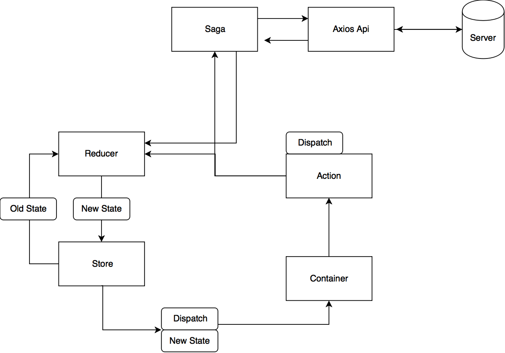
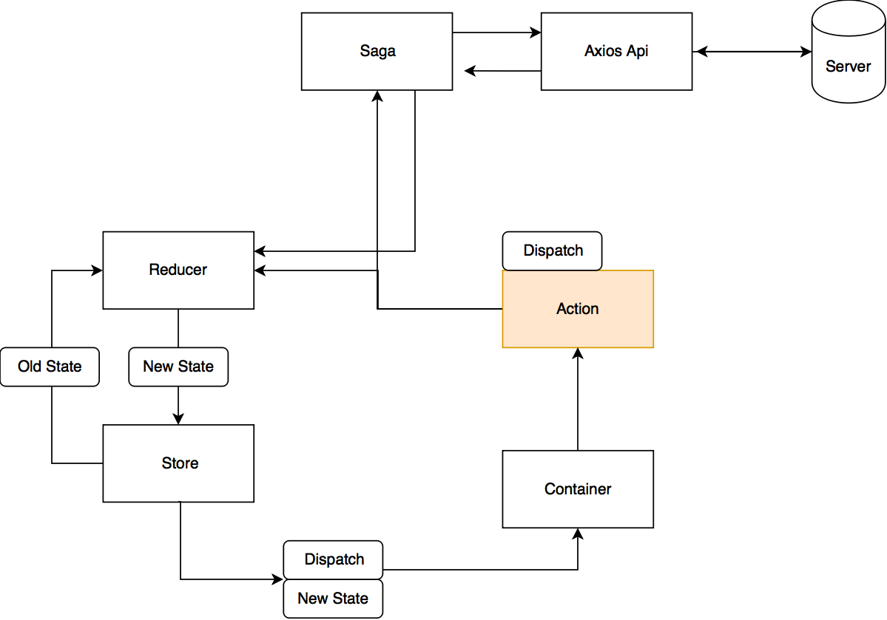
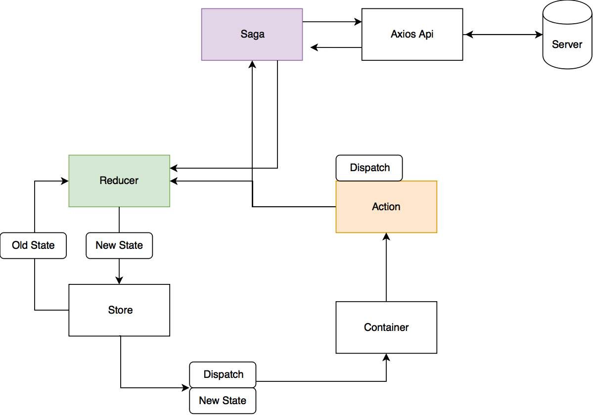
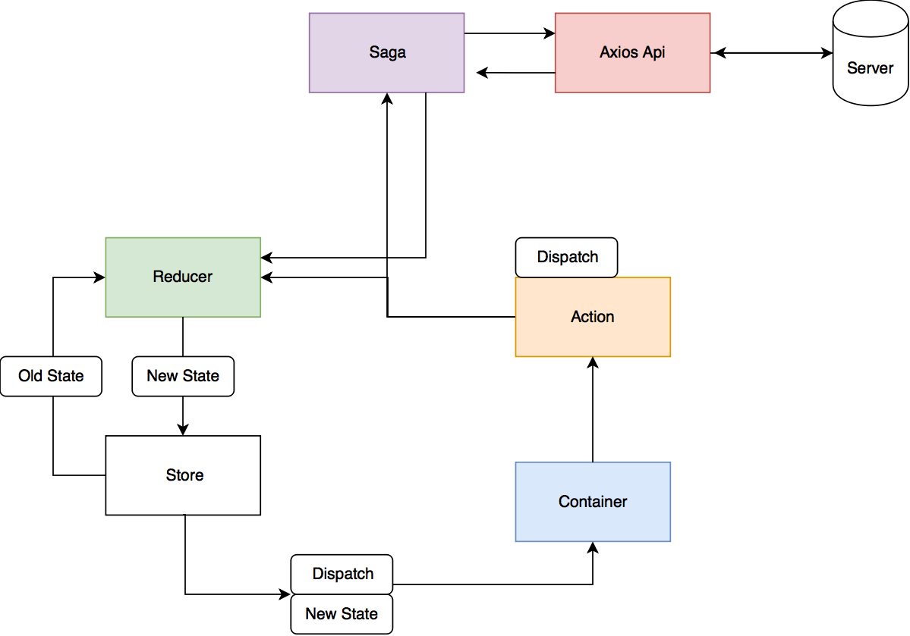
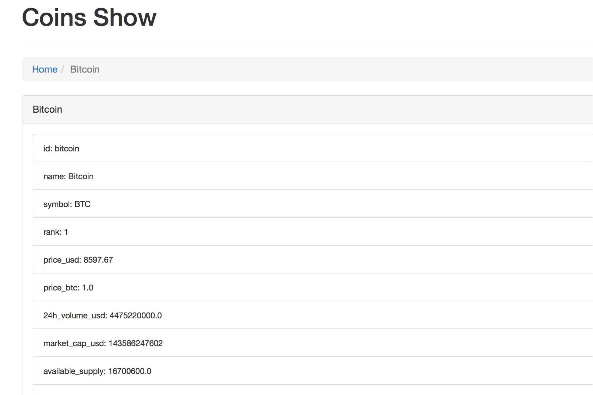

# About
This repository is a sample project of s2s Redux Actions.
I will show you how to develop React Redux application using s2s completion.

Japanese here \
[日本語](./JAREADME.md)

# Getting start

Install the library with this command.

```
$ yarn
```

# Launch Server
This application has two servers. React server and s2s server. \
Let's launch the main React server first.

```
$ yarn start
```
Launch the s2s server in another terminal window.

```
$ yarn run s2s
```
When the React server starts up, the browser opens. \
Information pulled from the API server of the public crypto currency is displayed.


# How to use

If you want to skip the tutorial and learn how to use the specific Redux Actions plugin, please see how to develop using the Redux Actions Manager plugin from the link.

- [Development using Redux Actions Manager plugin](#development-using-redux-actions-manager-plugin)

# Tutrial

## Abstract of Tutorial
This tutorial aims to create web services using s2s-redux-actions. \
This web service gets data from api server that is publishing cryptocurrency information and display it.
A list of cryptocurrencies has already been completed. You can check with the below command.

```
yarn start
```
This tutorial introduces the flow of creating a crypto currency detail page. \
I hope you enjoy reading and reading.

## Over the past of React Redux
Until now, React Redux application has too many file creation and configuration descriptions. \
I was looking for github to see if I can simplify this troublesome coding, and I went around looking at Medium, but there was nothing that could be greatly improved.

As a result, React Redux had a lot of preparation to write the application, so you could hardly work on creating and designing Container and Component.

Of course it is possible to do it to spend time.

However, for the programer who is coding Rails, the React Redux coding which is far from the Rails philosophy CoC（Convention over Configuration）and DRY（Don't Repeat Yourself) was painful.

Meanwhile, s2s deployed, the possibility of coding that does not rely on boilerplate or copy and paste has been becoming.

Since there was no plug-in that supports redux-actions in the original s2s, I made plugins.

This introduces usage of s2s and explains how the React Redux framework works.


### Structure of React Redux

Applications are built based on what is written in this article.
https://qiita.com/mpyw/items/a816c6380219b1d5a3bf



The bottom image is the actual structure of CoinIndex.


Then let's create CoinsShow container which displays the detail information of crypto currency.

### Preparation
Since `s2s.config.js` in the top directory is set up using the manager plugin, change it for the tutorial. \
The s2s configuration file for the tutorial is `s2s.tutorial.config.js`.

```
$ mv s2s.config.js s2s.main.config.js
$ mv s2s.tutorial.config.js s2s.config.js
```

### Create Redux Actions

First we will create redux actions. Create a `coin.js` file in the `src/actions` folder. \
s2s template function runs and inserts template code of redux actions into `coin.js`.


```js
import { createAction } from 'redux-actions'
```
This template is `redux-action.js` in the `templates` folder of top directory.

Open the file, write `getCoinRequest` and save it. \
s2s expands code like this.

```js
import { createAction } from "redux-actions";

export const getCoinRequest = createAction("GET_COIN_REQUEST");
export const getCoinSuccess = createAction("GET_COIN_SUCCESS");
export const getCoinFailure = createAction("GET_COIN_FAILURE");
```
The s2s plugin that expands code is s2s-redux-actions.

#### s2s-redux-actions-root

As soon as the file is changed under `src/actions`, s2s-redux-actions-root is run and `coin.js` path is inserted in `src/actions/index.js`.

In other words, since s2s is watching the files in the actions folder, you don't have to add the code every time you create a file in `src/actions/index.js`.

`src/actions/index.js`
```js
export * from "./coin";
export * from "./coins";
```

Now we have created reducex actions



### Create Redux Actions Reducers


Next, let's create a Reducer that generates State based on Action.

Reducer is connected with the action created before as a one-to-one. When Action is called in Container, State written in Reducer is created and passed to Container.

As you can also see a conceptual diagram, rather than updating State, it adopts a method to create a new State.

Create a `coin.js` in the `src/reducers` folder. \
It's a same as actions, template will be expanded.

```js
import { handleActions } from 'redux-actions'
import * as actions from '../actions'

const initialState = {}

export default handleActions(
  {},
  initialState
)
```
It is a bit hard to see, but write `getCoinRequest` in` {} `of handleActions and save it.

```js  
export default handleActions(
  {getCoinRequest},
  initialState
)
```

S2s will expand the code.

```js
import { handleActions } from "redux-actions";
import * as actions from "../actions";

const initialState = {};

export default handleActions(
  {
    [actions.getCoinRequest]: (state, action) => ({
      ...state
    }),
    [actions.getCoinSuccess]: (state, action) => ({
      ...state
    }),
    [actions.getCoinFailure]: (state, action) => ({
      ...state
    })
  },
  initialState
);
```

We change the code.
Write the default state of `coin` in` initialState`. \
Next, add `coin: action.payload [0]` to `action.getCoinSuccess`. \
This is a process to push the data returned by saga into the coin state. \
The reason for specifying the zeroth of the array is that this crypto currency API returns data in an array even though it gets information on one crypto currency.


```js
import { handleActions } from "redux-actions";
import * as actions from "../actions";

const initialState = {
  coin: {
    id: "",
    name: "",
    symbol: "",
    rank: "",
    price_usd: "",
    price_btc: "",
    "24h_volume_usd": "",
    market_cap_usd: "",
    available_supply: "",
    total_supply: "",
    max_supply: "",
    percent_change_1h: "",
    percent_change_24h: "",
    percent_change_7d: "",
    last_updated: ""
  }
};

export default handleActions(
  {
    [actions.getCoinRequest]: (state, action) => ({
      ...state
    }),
    [actions.getCoinSuccess]: (state, action) => ({
      ...state,
      coin: action.payload[0]
    }),
    [actions.getCoinFailure]: (state, action) => ({
      ...state
    })
  },
  initialState
);
```

You made a green Reducer.


## Create Redux Sagas

Next time we will create Saga. \
Saga's role is asynchronous processing of redux-actions. \
In principle, Reducer should not write a program whose value changes depending on cases. \
Saga will come between Action and Reducer to solve this problem. \

Basically there are three things to write in Saga.

1. Which action triggers saga when called
2. Which API endpoint to throw HTTP request toward
3. How to change the state of the Reducer when the request succeeds or fails.

Create a `coin.js` in the `src/sagas` folder. \
S2s expands the template of saga.

```js
import { put, call,takeLatest } from 'redux-saga/effects';
import * as actions from '../actions';
import api from '../api';

export default [];
```

Let's write `getCoinRequest` before `export default [];` and save it.


```js
import { put, call,takeLatest } from 'redux-saga/effects';
import * as actions from '../actions';
import api from '../api';

getCoinRequest

export default [];
```

S2s will automatically expand the code.

```js
import { put, call, takeLatest } from "redux-saga/effects";
import * as actions from "../actions";
import api from "../api";

export function* handleGetCoinRequest(action) {
  try {
    const { data } = yield call(api.getCoinRequest, action.payload);
    yield put(actions.getCoinSuccess(data));
  } catch (error) {
    yield put(actions.getCoinFailure(error));
  }
}

export default [
  takeLatest(actions.getCoinRequest.toString(), handleGetCoinRequest)
];
```

You made purple Saga.



## Create Axios api

Axios api is the place to manage API endpoints. \
You will write where the server URL and what kind of HTTP request. \
In this tutorial, axios uses the common setting code in the src folder and imports it.

Create a `coin.js` in the `src/api` folder. \
s2s inserts the axios api template.

```js
import axios from "../axiosConfig"
```

Write `getCoinRequest` there and save it. \
s2s expands the below code.

```js
import axios from "../axiosConfig";

export const getCoinRequest = config => axios.get(``, config);
```

Edit it so that the correct endpoint of the crypto currency can get.

```js
import axios from "../axiosConfig";

export const getCoinRequest = (id, config) =>
  axios.get(`/v1/ticker/${id}/`, config);

```
You create a red Axios Api


Then you had tried almost all of the Redux Actions S2S framework.
Your rest working is to write a Container.

## Create a CoinsShow Container

We will create a Container that displays detail information of crypto currency using the Redux Action we created. \
Create a `CoinsShow.js` in the `src/containers` folder.

Since we are using the template function of s2s, the below template code inserts into CoinsShow.js.


```js
import React, { Component } from 'react'
import PropTypes from 'prop-types'
import { connect } from 'react-redux';
import { bindActionCreators } from 'redux';
import * as actions from '../actions'

class ClassNameHere extends Component{
  render () {
    return ()
  }
}

ClassNameHere.propTypes = {}

const mapStateToProps = (state, ownProps) => {
  return {}
}
const mapDispatchToProps = dispatch => bindActionCreators({

},dispatch)

export default connect(mapStateToProps, mapDispatchToProps)(ClassNameHere)
```

Please change `ClassNameHere` to `CoinsShow`。 \
And update like this.

```js
import React, { Component } from 'react'
import PropTypes from 'prop-types'
import { connect } from 'react-redux';
import { bindActionCreators } from 'redux';
import {} from '../actions'
import styled from 'styled-components'
import { Link} from 'react-router'
import {Breadcrumb,ListGroup,ListGroupItem,PageHeader,Panel} from 'react-bootstrap';

class CoinsShow extends Component{
  componentDidMount(){
   this.props.getCoinRequest(this.props.params.id)
  }
  render () {
    const { coin } = this.props

    const data = Object.keys(coin).map(key => (
      <ListGroupItem key={key}><small>{key}: {coin[key]}</small></ListGroupItem>
    ))

    return (
      <Wrapper>
        <PageHeader>Coins Show</PageHeader>
        <Breadcrumb>
          <Breadcrumb.Item>
            <Link to='/'>Home</Link>
          </Breadcrumb.Item>
          <Breadcrumb.Item active>
            {coin.name}
          </Breadcrumb.Item>
        </Breadcrumb>
        <Panel header={coin.name}>
          <ListGroup>
            {data}
          </ListGroup>
        </Panel>
      </Wrapper>
    )
  }
}

CoinsShow.propTypes = {}

const Wrapper = styled.div`
  margin: 25px 40px;
`

const mapStateToProps = (state, ownProps) => {
  return {
    coin: state.coin.coin
  }
}
const mapDispatchToProps = dispatch => bindActionCreators({
  getCoinRequest
  },dispatch)

export default connect(mapStateToProps, mapDispatchToProps)(CoinsShow)
```
What you're doing is a simple React Redux basic program.
You made a light blue Container.



## Router setting

Finally, set up the React Router.

Open the `src/containers/CoinsIndex.jsx` and import react-router library.

```js
import { Link } from 'react-router';
```

Edit the container's jsx from

```js
<td>{name}</td>
```

to

```js
<td><Link to={`/coins/${id}`}>{name}</Link></td>
```

You created a link to move from CoinsIndex to CoinsShow.

Open the `src/routes.jsx` and update it.

```js
import React from 'react'
import { Route, IndexRoute } from 'react-router';

import App from './containers/App';
import CoinsIndex from './containers/CoinsIndex'
import CoinsShow from './containers/CoinsShow'

export default (
  <Route path="/" component={App} >
    <IndexRoute component={CoinsIndex} />
    <Route path="coins/:id" component={CoinsShow} />
  </Route>
)
```

After save the file, access http://localhost:3000 with browser. \
CoinsIndex has a link to CoinsShow and clicking on it


Detail information of crypto currency is displayed.



The tutorial is over. Did you understand the whole structure of React Redux? \

If you create React Redux application using the manager plugins, you can write code much more easier and faster than this tutorial. so please challenge that too.


# Development using Redux Actions Manager plugin

## About Manager plugin
This chapter will make it easier to understand if you try to read a tutorial and then look it up.

As you can see from the tutorial, there are some shared things in React Redux application.

 1. The file name is common in the `actions, reducers, sagas, api` folders
 2. Action names are shared in the `actions, reducers, sagas, api` folders

The Manager plugin manages these in a nice way.

When you create a file in the `builders` folder, the manager plugin creates a file with the same name in the` actions, reducers, sagas, api` folders.

At the same time, manager plugin manages the action name written in `builders/*.js` and automatically synchronizes with` actions, reducers, sagas, api` files.


## Preparing (For who did the tutorial)

The coder who did the tutorial, let's do a git stash to keep code.

```
$ git add .
$ git stash save "tutorial"
```
Restart s2s server.

```
$ yarn run s2s
```

## Create builders files

Create a `coin.js` in the `src/builders` folder.

How about that, `coin.js` would have been created in the each ` actions, reducers, sagas, api` folders.
Next write this code in the `src/builders/coin.js`

`src/builders/coin.js`
```js
getCoinRequest
```
Save it and s2s expands like this.

```js
let getCoinRequest;
let getCoinSuccess;
let getCoinFailure;
```

At the same time, the created action name is inserted in all coin.js of the `actions, reducers, sagas, api` folders.
Please check it out.


Of course you can also delete actions. \
Let's try deleting all the action names written in `src/builders/coin.js` and save it.

I think that the action names written in all other `coin.js` will be deleted.

However, even if you delete the file in `src/builders`, files of the same name in`actions, reducers, sagas, api` are not deleted for safety.

The manager plugin manages only the existence or not of the action name. \
After that, if you do the same thing as the above tutorial, you will be able to create Container for detail information of crypto currency.

If you have any bugs or questions, please throw to github's issue.
Good React Redux coding!
